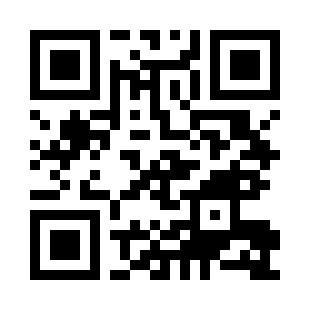

# goVLESS — Anten-ka (Lite)

VPN на базе **3X-UI + Xray (VLESS Reality)** с маскировкой под чужой сайт: anti-DPI, XTLS-Vision, без домена. Это community-сборка — режим **Lite**. Pro-режим (свой домен + TLS, сайт-прикрытие, Telegram-бот и мини-приложение) доступен подписчикам **Anten-ka Club**.

## Как это работает

goVLESS ставит на ваш сервер связку **3X-UI** (веб-панель управления) + **Xray-core** (движок) и поднимает VPN по протоколу **VLESS** с маскировкой **Reality** — всё одной командой, без ручной возни с конфигами.

По слоям:

- **3X-UI** — панель управления в браузере (по HTTPS): пользователи, инбаунды, подписки, статистика.
- **Xray + VLESS** — быстрый современный протокол без лишних «подписей», по которым DPI обычно вычисляет VPN.
- **Reality (режим Lite)** — вместо своего домена и сертификата Xray на лету «одалживает» TLS реального стороннего сайта (например, `yandex.ru`, `google.com`, `apple.com`). При подключении DPI видит настоящий TLS-хендшейк к легитимному сайту и пропускает трафик. Поэтому Lite **не требует домена**.
- **XTLS-Vision** — транспорт, убирающий двойное шифрование «TLS-в-TLS»: ниже задержка, выше скорость, устойчивее к анализу.
- **uTLS-отпечаток (fingerprint)** — клиент притворяется браузером (по умолчанию `safari`), чтобы TLS-«рукопожатие» выглядело как обычный браузерный трафик.

Что происходит при установке:

1. Ставятся зависимости, затем **3X-UI + Xray**.
2. Генерируются Reality-ключи и N клиентских ключей (VLESS-ссылки + QR-коды).
3. Поднимается инбаунд на `:443` с выбранным сайтом-маскировкой.
4. Выдаются данные для входа в панель и готовые ключи. Дальше всё управляется командой **`govless`**.

## Требования
- Чистый VPS на **Ubuntu/Debian**, доступ **root** (через `sudo`).
- Рекомендуется сервер **без уже установленного 3X-UI** (если панель уже есть — см. ниже).

## Установка

```bash
curl -fsSL https://raw.githubusercontent.com/anten-ka/govless-lite-version/main/install.sh | sudo bash
```

Скрипт сам доустановит остальные зависимости (sqlite3, jq, python3), поставит 3X-UI + Xray, поднимет VLESS Reality и выдаст ключи и QR-коды.

## Что спросит установщик
1. **Язык** — русский / English.
2. **Дисклеймер** — принять (1).
3. **Режим** — *Lite (Reality)* по умолчанию. *Pro* и *«Ленивый Pro»* показывают экран Anten-ka Club (см. ниже).
4. **Сайт маскировки** — список из 100 RU / 100 международных сайтов (определяется по гео сервера), каждый проверен реальным Reality-хендшейком; можно ввести свой (пункт 0).
5. **Версия панели** — 3X-UI новая или как во всех гайдах.
6. **Транспорт** — TCP (рекомендуется).
7. **Отпечаток** (fingerprint) — по умолчанию `safari`, и **число ключей**.

В конце — данные для входа в панель, ключи и QR. Сканируйте ключ в приложении **INCY** (iOS / Android).

## Управление после установки
Команда **`govless`** открывает меню:
- **VPN** — установить/обновить, перезапуск, логи
- **Пользователи** — список, ссылки, QR-коды
- **Управление** — бэкап/восстановление, удаление
- **⭐ Перейти на PRO** — сравнение Lite vs PRO + вступление в клуб
- **🏆 Правильный хостинг** — проверенные партнёры с промокодами
- **О программе**

## Если на сервере уже стоит 3X-UI
Установщик не тронет вашу панель, а предложит: открыть её, сбросить логин/пароль, удалить (с бэкапом) и поставить goVLESS, либо выйти.

## PRO-режим · Anten-ka Club

**Lite** маскируется под **чужой** сайт (Reality) — быстро и без домена. **PRO** маскируется под **ваш собственный** сайт (TLS + свой домен + Let's Encrypt + реальная веб-страница-прикрытие). Это гибче и функциональнее: своя страница, **Telegram-бот управления** и **веб-мини-приложение**, тоньше настройки маскировки.

**Pro-скрипты доступны по подписке в Anten-ka Club.** Там же:
- 🔒 Pro-сборки (домен + TLS, маскировка под реальный сайт, бот и мини-апп)
- 💬 Закрытое сообщество **1300+ участников**: поддержка, гайды, обмен опытом
- 🤖 ИИ-боты-помощники
- ⚡ Ранний доступ к закрытым обновлениям и новым фишкам

**Вступить / оформить подписку:** **https://vk.cc/cUQNzV**

<p>
  
</p>

*Наведите камеру телефона на QR — откроется страница вступления в клуб и доступа к PRO-скриптам и закрытому чату.*

## Ссылки
- 🎬 YouTube: https://www.youtube.com/antenkaru
- ☕ Boosty: https://boosty.to/anten-ka
- 🏆 Anten-ka Club (PRO-подписка + закрытый чат): https://vk.cc/cUQNzV

© 2025–2026 anten-ka. Source-available (см. файл LICENSE).
